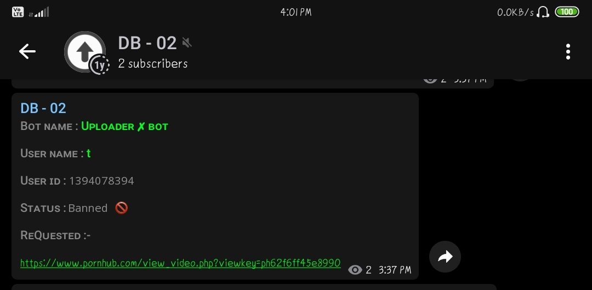

#### [UPLOADER X BOT](https://t.me/uploader_x_bot)

``` python

file_location = 'blocked.txt'

my_file = open(file_location, "r")

data = my_file.read()
  
data_into_list = data.split("\n")

my_file.close()

```

<p align="center">
  
</p>
